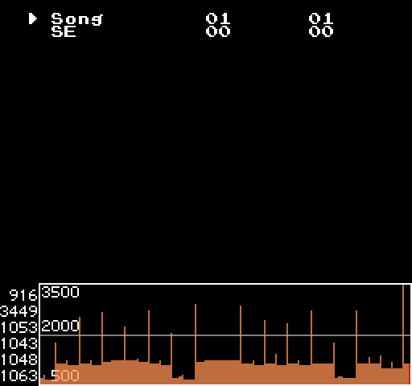

# Mesen scripts  

Junk.  

## Library  

### [GetINesInfo.lua](GetINesInfo.lua)  

Get mapper number.  
**UNIF, FDS, NSF are not supported.**  

See [sample](Sample/GetINesInfoSample.lua).  

### [GetUsingSoundChips.lua](GetUsingSoundChips.lua)  

See [sample](Sample/GetUsingSoundChipsSample.lua).  

## Utility  

### [ElapsedCycleLog.lua](ElapsedCycleLog.lua)  

  

Graphs the number of cycles required for the two specified addresses.  

Example of setting in the JSR instruction:  

```asm
8000 : JSR $C0DE	; set start address
8003 : RTS		; set end address
```

```lua
local startAddress	= 0x8000		-- $8000
local endAddress	= startAddress + 3	-- $8003
local screenWidth	= 256			-- screen size depends on the overscan setting
local screenHeight	= 240
local drawHeight	= 64			-- size to display graph
```

## License  

[MIT License](LICENSE).  
